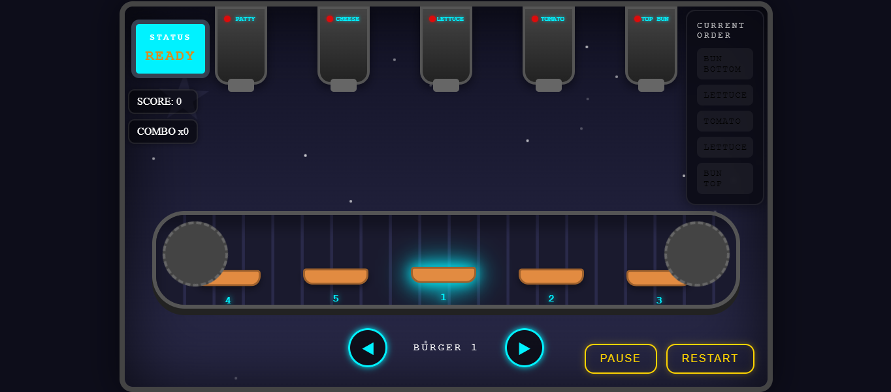

# 🍔 Midnight Burger Factory

Un juego arcade y de simulación desarrollado con **HTML, CSS y JavaScript**, donde debes administrar una fábrica nocturna de hamburguesas mientras atiendes pedidos rápidamente antes de que el tiempo se agote.  

El jugador deberá preparar las hamburguesas correctamente, elegir los ingredientes adecuados y mantener el ritmo de producción mientras la dificultad aumenta progresivamente.  

---

## 🚀 Demo en Vivo
👉 [Prueba Midnight Burger Factory aquí](https://joganyt01.github.io/Midnight-Burger-Factory/)

---

## 📸 Capturas del juego

<table>
  <tr>
    <td align="center"><b>Gameplay</b></td>
    <td align="center"><b>Preparación de pedidos</b></td>
  </tr>
  <tr>
    <td></td>
    <td></td>
  </tr>
</table>

---

## ✨ Características

- 🍔 Sistema dinámico de preparación de hamburguesas.  
- ⏱️ Pedidos con tiempo límite para aumentar la dificultad.  
- 🎮 Mecánicas arcade rápidas y adictivas.  
- 📈 Dificultad progresiva a medida que avanzas.  
- 🔊 Música y efectos de sonido inmersivos.  
- 🎨 Estilo visual retro inspirado en juegos clásicos.  
- 📱 Diseño responsive compatible con distintos dispositivos.  
- ⚡ Animaciones y transiciones fluidas.  
- 🧠 Sistema de lógica para validación de pedidos correctos e incorrectos.  

---

## 🛠️ Tecnologías utilizadas

- HTML5  
- CSS3  
- JavaScript  

---

## 📂 Estructura del proyecto

midnight-burger-factory/  
├── index.html       # Página principal  
├── style.css        # Estilos del juego  
├── script.js        # Lógica principal  
├── assets/          # Imágenes y recursos visuales  
├── sounds/          # Música y efectos de sonido  
└── animations/      # Recursos de animaciones  

---

## 🎯 Objetivo del proyecto

Midnight Burger Factory fue creado como un proyecto enfocado en el desarrollo de videojuegos web interactivos, mejorando habilidades en lógica de programación, sistemas dinámicos, animaciones y experiencia de usuario.

---

## 🚧 Estado del proyecto

🛠️ En desarrollo — se planean nuevas mecánicas, más ingredientes, enemigos/eventos especiales y mejoras visuales.

---

## 👨‍💻 Autor

Desarrollado con ❤️ por **Johanyt**

---
